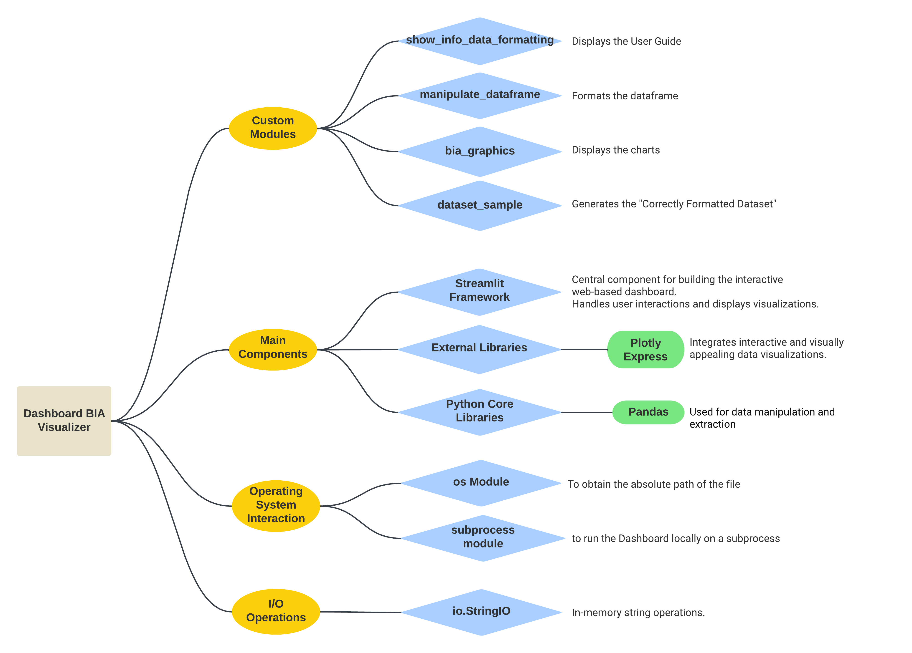

# 📊 Bioelectrical Impedance Analysis (BIA) Dashboard Visualizer

This project is designed for individuals who frequently monitor their body status using **bioelectrical impedance analysis (BIA)** but find it challenging to interpret .csv formatted data. With this project, you can easily visualize how your diet, training, and health are progressing.

## 📑Table of Contents

- [About](#about)
- [Getting Started](#getting-started)
- [Prerequisites](#prerequisites)
- [Webapp Structure](#webappstructure)
- [Contact](#contact)

## 📝 About
Please check **"Presentation of BIA-Dashboard Visualizer.pdf"** to quickly know more about this project. <br>
This web application enables you to create visual representations of the following factors:

1. Weight in kg/lb
2. Fat-Mass (FM) in kg/lb and %
3. Fat-Free-Mass (FFM) in kg/lb and %
4. Intra-Cellular-Weight (ICW%)
5. Extra-Cellular-Weight (ECW%)
6. Basal Metabolic Rate (BMR)

The application will display these data based on their respective ExamDate.

## 🚀 Getting Started

You can use this project on your browser at the following link: [BIA Dashboard Visualizer](https://bia-dashboard-visualizer.streamlit.app/)

In the web application, you can download a **"Correctly Formatted Dataset"** to see how your data needs to be structured for the application to work properly.

### 🏠 Launch Locally

If you want to launch the app locally, please make sure to install all the prerequisites first. Once you have everything you need, simply open `1_BIA-Dashboard.py` in your IDE and run the code. The app will be launched locally.

### 🛠️ Prerequisites
To run this app locally, Python needs to be installed, go to the [Official Python Website](https://www.python.org/). <br>
After Python has been installed, run this command in your terminal if you want to launch the app locally:

```bash
pip install -r requirements.txt
```
Make sure to navigate in the right directory where **requirements.txt** is located.

## 🌐 WebApp Structure



## 📧 Contacts
You can find all my contacts on the [**Contact Page**](https://bia-dashboard-visualizer.streamlit.app/Contacts) <br> **Thank you!**
